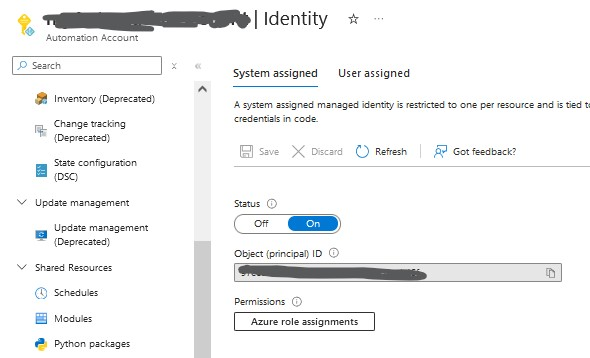
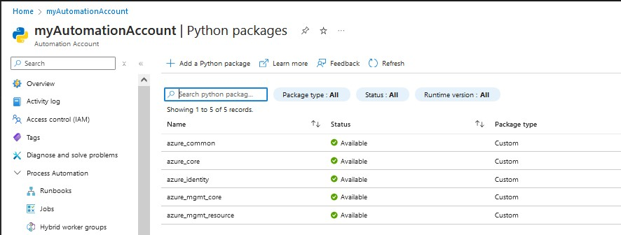
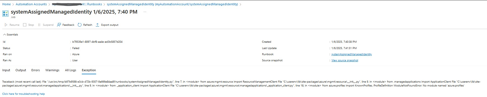
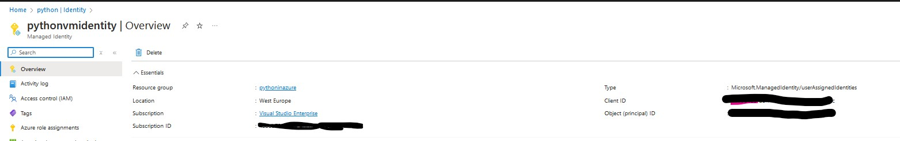
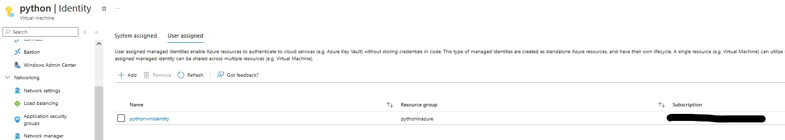
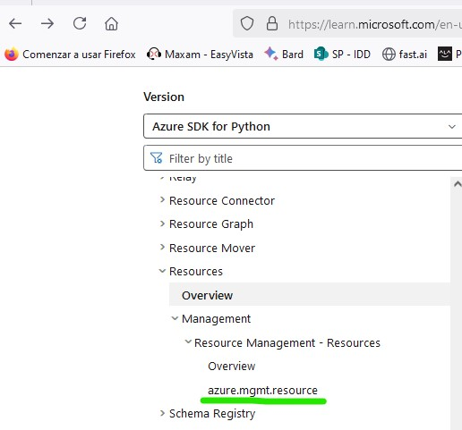
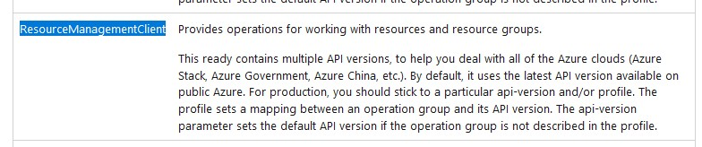
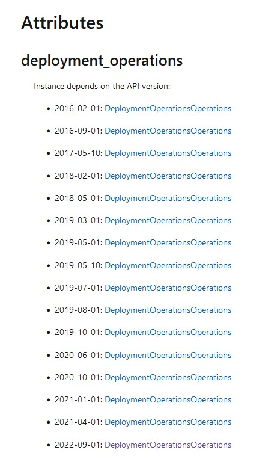
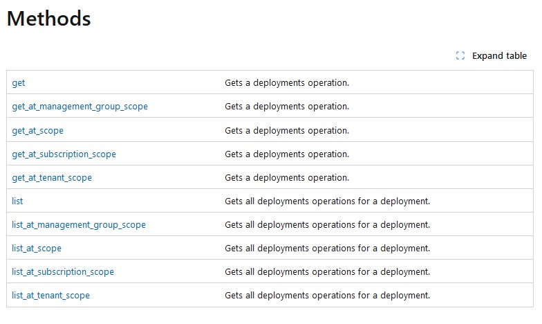

# azureScriptPython
# Documentation lins
# https://learn.microsoft.com/en-us/azure/developer/python/sdk/authentication/overview
# https://learn.microsoft.com/en-us/python/api/overview/azure/identity-readme?view=azure-python
# https://learn.microsoft.com/en-us/graph/api/resources/users?view=graph-rest-1.0

# Introduction
In a world AI is going to run the scripting process, [Azure SDK ](https://learn.microsoft.com/en-us/azure/developer/) documentation is not addressed to solved very specific questions from a non expert developer. 
So I am going to explain here in a practical points some questions to develop apps in python for Azure.
  
# [Authentication](https://learn.microsoft.com/en-us/azure/developer/python/sdk/authentication/overview)
Obviously the first point is to authenticate in Azure. There are several ways of doing it and surprinsingly I will explain the most common one at the end.
  
## Managed identity support
There are 2 kinds of managed identities in Azure **user assigned** and **system assigned**
Let's start with **system defined**
  
### system-assigned managed identity
For instance you want to run a runbook from an automation account using its system assinged identity.
  
First You have to enabled the system-assigned managed identity and assigned the rights on IAM

  
Then you have to load the modules required for the python script. In my example systemAssignedManagedIdentity.py the modules are
  

  
If you do not know the modeles to load, just run the script and check the error. 
  

I found this misterous error where it complaint about module **azure.profiles** missing and the module you have to load is **azure_common**. If one day Azure is lost and needs a direction I hope someones helps it as much as it helped me with this error. :D

Once all prereq are done you can run the script. You can find as example systemAssignedManagedIdentity.py 
  
## user-assigned managed identity
First we will create de user-assigned managed identity. According to the [documentation](https://learn.microsoft.com/en-us/python/api/overview/azure/identity-readme?view=azure-python) the user-assigned managed identity must be of one of this types:
- Azure App Service and Azure Functions
- Azure Arc
- Azure Cloud Shell
- Azure Kubernetes Service
- Azure Service Fabric
- Azure Virtual Machines
- Azure Virtual Machines Scale Sets

So we create a user-assigned managed identity
  

  
  
and in one of the before mentioned resources, VM in my case, I assign the user-assigned managed identity.
  

  
and we assigned the rights we need on IAM.
  
Finally we log on the virtual machine and we run our python script. If we use modules, that we use we need to install them. I installed [python3](https://www.python.org/downloads/) and installed 2 modules running **pip install azure.identity** and **pip install azure.mgmt.resource**

We can get credentials for the script in 3 ways
- from user-assigned managed identity clientID as in example userAssignedManagedIdentityClientID.py
- from user-assigned managed identity objectID as in example userAssignedManagedIdentityObjectID.py
- from user-assigned managed identity resourceID as in example userAssignedManagedIdentityResourceID.py
  
## AzureCliCredenti
If you have logged using Azure cli commands **az login -t tenantID** and **az set -s subscriptionID** you can use this credentials to run pythong commands as shown in example cliCredentials.py

## DefaultAzureCredential
This is probably the most common and interesting way to authenticate in Azure.
DefaultAzureCredential goes through a number of authentication ways and it uses the first option available
  
1. A service principal configured by environment variables. See EnvironmentCredential for more details.
2. WorkloadIdentityCredential if environment variable configuration is set by the Azure workload identity webhook.
3. An Azure managed identity. See ManagedIdentityCredential for more details.
4. On Windows only: a user who has signed in with a Microsoft application, such as Visual Studio. If multiple identities are in the cache, then the value of the environment variable AZURE_USERNAME is used to select which identity to use. See SharedTokenCacheCredential for more details.
5. The identity currently logged in to the Azure CLI.
6. The identity currently logged in to Azure PowerShell.
7. The identity currently logged in to the Azure Developer CLI.
  

# Our firs python script using SDK
First we need to identyfy the packages we need. We have the list of packages [here](https://learn.microsoft.com/en-us/python/api/overview/azure/?view=azure-python)
  

If we want to list all resources in a subscription we should go to resources. And we go to the package, in our case azure.mgmt.resource
  

  
Here we can see the classes available, we look into ResourceManagementClient

  
here we can see the API version we work with
  

and finally we can see the methods available
  

# Examples
I have a few examples
- list all resource groups in a subscription. listAllRgSubs.pu
- list all subscription in a tenant. listSubs.py
